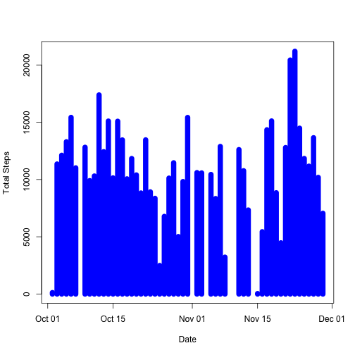
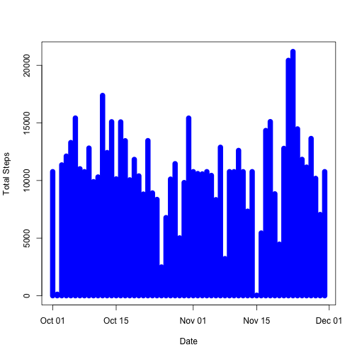

# Reproducible Research: Peer Assessment 1


## Loading and preprocessing the data

Load the data 

```r
activity <- read.csv(unz("activity.zip", "activity.csv"))
```

Process/transform the data into a format suitable for analysis


```r
# remove NA
processedActivity <- activity[complete.cases(activity[,c("steps")]),] 
#change to numeric
suppressWarnings(processedActivity[, c("steps")] <- as.numeric(processedActivity[,c("steps")]))
#change to date
suppressWarnings(processedActivity[, c("date")] <- as.Date(processedActivity[,c("date")],format = "%Y-%m-%d"))
```
 

## What is mean total number of steps taken per day?

Make a histogram of the total number of steps taken each day


```r
library(plyr)
# sumrize date wise for total steps
summarizedActivity <- ddply(processedActivity, c("date"), summarise, totalSteps = sum(steps))
#draw plot
plot(summarizedActivity$date, summarizedActivity$totalSteps,type="h", main="",ylab="Total Steps",xlab="Date",lwd = 10,col = "blue")
```

 

Mean and median total number of steps taken per day

```r
# mean and median total number of steps taken per day
mean(summarizedActivity$totalSteps)
```

```
## [1] 10766
```

```r
# mean and median total number of steps taken per day
median(summarizedActivity$totalSteps)
```

```
## [1] 10765
```

## What is the average daily activity pattern?

Make a time series plot (i.e. type = "l") of the 5-minute interval (x-axis) and the average number of steps taken, averaged across all days (y-axis)


```r
# sumrize intervel wise for average steps
summarizedActivityForInterval <- ddply(processedActivity, c("interval"), summarise, averageSteps = mean(steps))

#draw plot
plot(summarizedActivityForInterval$interval, summarizedActivityForInterval$averageSteps,type="l", main="",ylab="Total Steps",xlab="Date")
```

 

Which 5-minute interval, on average across all the days in the dataset, contains the maximum number of steps?


```r
summarizedActivityForInterval[summarizedActivityForInterval$averageSteps == max(summarizedActivityForInterval$averageSteps),]
```

```
##     interval averageSteps
## 104      835        206.2
```
## Imputing missing values

Total number of missing values in the dataset (i.e. the total number of rows with NAs)

```r
nrow(activity[activity$steps == "NA",])
```

```
## [1] 2304
```

Devise a strategy for filling in all of the missing values in the dataset. The strategy does not need to be sophisticated. For example, you could use the mean/median for that day, or the mean for that 5-minute interval, etc.

Create a new dataset that is equal to the original dataset but with the missing data filled in


```r
for( timeInterval in summarizedActivityForInterval$interval)
{
activity[replace(activity[,"steps"],is.na(activity[,"steps"]),-2)==-2 & activity$interval == timeInterval,"steps"]<- summarizedActivityForInterval[summarizedActivityForInterval$interval==timeInterval,"averageSteps"]
}
```

Histogram of the total number of steps taken each day 


```r
#change to numeric
suppressWarnings(activity[, c("steps")] <- as.double(activity[,c("steps")]))
#change to date
suppressWarnings(activity[, c("date")] <- as.Date(activity[,c("date")],format = "%Y-%m-%d"))
# sumrize date wise for total steps
summarizedActivity <- ddply(activity, c("date"), summarise, totalSteps = sum(steps))
#draw plot
plot(summarizedActivity$date, summarizedActivity$totalSteps,type="h", main="",ylab="Total Steps",xlab="Date",lwd = 10,col = "blue")
```

 

Mean and median total number of steps taken per day

```r
# mean and median total number of steps taken per day
mean(summarizedActivity$totalSteps)
```

```
## [1] 10766
```

```r
# mean and median total number of steps taken per day
median(summarizedActivity$totalSteps)
```

```
## [1] 10766
```
## Are there differences in activity patterns between weekdays and weekends?

new factor variable in the dataset with two levels isWeekend or not

```r
activity$day <- weekdays(activity$date)
activity$isWeekend <- activity$day %in% c("Sunday", "Suturday")
```


Plots containing a time series plot (i.e. type = "l") of the 5-minute interval (x-axis) and the average number of steps taken for weekday and weekend


```r
library(ggplot2)
# sumrize intervel wise for average steps
summarizedActivityForWeekDay <- ddply(activity, c("interval","isWeekend"), summarise, averageSteps = mean(steps))
summarizedActivityForWeekDayList <- dlply(summarizedActivityForWeekDay, .(isWeekend))

#draw plot
par(mfrow = c(2, 1), mar = c(5, 4, 2, 1))
 
# draw plot 1
plot(summarizedActivityForWeekDayList[['TRUE']]$interval, summarizedActivityForWeekDayList[['TRUE']]$averageSteps,type="l", main="",ylab="Number of steps",xlab="Weekend") 
  
  # draw plot 2
plot(summarizedActivityForWeekDayList[['FALSE']]$interval, summarizedActivityForWeekDayList[['FALSE']]$averageSteps,type="l", main="",ylab="Number of steps",xlab="Weekday")
```

 
